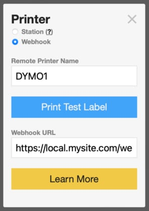

## Kidddo Raspberry Pi Print Webhook Example (Node.js)

This is an example of how to utilize Kidddo's [Print Webhook](https://kidddo.com/print-webhook) feature to create your own Print Server on a Raspberry Pi. This guide is intended for experienced developers - attempt at your own risk. At the time of this writing the latest version of Node.js and referenced modules work - but you will want to verify and make modifications as necessary.

## Requirements
* We'll assume that you already have a [Raspberry Pi](https://www.raspberrypi.com) with an OS installed and ssh access. (We'll be using Raspbian with the default user "pi" for this example)
* A connected printer. We'll be using a DYMO LabelWriter 450 connected via USB for this example.
* **Your device must be accessible on the internet.** Whether you configure your router manually or use a Tunneling service such as [localhost.run](https://localhost.run) this example will not work. If this is beyond your expertise DO NOT ATTEMPT THIS GUIDE.

## Install Software

> The following process takes about 20 minutes

#### Install Node.js
Add a repository for [Node.js](https://nodejs.org) - which is the platform that our Print Server will run on:

    curl -fsSL https://deb.nodesource.com/setup_lts.x | sudo -E bash -

Install Node.js:

    sudo apt install nodejs

If Node installed correctly, we can check the version:

    node -v

The response should be something like: `v18.2.0`. 

#### Install dependencies for this example:
    
    npm install express ipp pdfkit

#### Download Example:
First, let's make a new directory in your PI's home folder:

    mkdir kidddo

Change Directory to "kidddo":

    cd kidddo

Download Example:

    git clone https://github.com/Kidddo/Raspberry-Pi-Print-Webhook-Example.git

Change Directory to "Raspberry-Pi-Print-Webhook-Example":

    cd Raspberry-Pi-Print-Webhook-Example

If you would like this script to run on a port other than `3000`, edit wh.js accordingly:

    nano wh.js

At this point you should be able to run the Example script:

	node wh.js
	
And it should be accessible via your browser at your publicly accessible url. e.g. `https://myurl.lhrtunnel.link`, or `http://local.mysite.com`.

The webhook POST endpoint in the example is `/webhook`.

Don't forget to enter this enter this full url (e.g. `https://local.mysite.com/webhook`) in your Kidddo [Settings](https://kidddo.com/admin#settings) > Printer Name > Webhook > Webhook URL:

#### Automatically start print server on boot-up 
*Since you've come this far, why not have the print server script automatically run on system boot?*

Create a start script for Node:

    nano print.sh

Put the following content in `print.sh` and exit/save:

    #!/bin/bash
    
    NODE=/opt/node/bin/node
    SERVER_JS_FILE=/home/pi/kidddo/Raspberry-Pi-Print-Webhook-Example/wh.js
    USER=pi
    OUT=/home/pi/kidddo/PrintServer.log
    
    case "$1" in
    
    start)
	    echo "starting node: $NODE $SERVER_JS_FILE"
	    sudo -u $USER $NODE $SERVER_JS_FILE > $OUT 2>$OUT &
	    ;;
    
    stop)
	    killall $NODE
	    ;;
    
    *)
	    echo "usage: $0 (start|stop)"
    esac
    
    exit 0

Make the script executable with 'chmod':

    chmod 755 print.sh

Copy it to '/etc/init.d':

    sudo cp print.sh /etc/init.d

Register the script as a service with 'update-rc.d':

    sudo update-rc.d print.sh defaults

#### Configure Printers
Install CUPS (Common Unix Printing System):

    sudo aptitude install cups

Add your user (pi) to the to the lpadmin group (so we can manage printers):

    sudo usermod -aG lpadmin pi

Next, we'll make a few changes to the CUPS Configuration:

    sudo nano /etc/cups/cupsd.conf

Change `Listen localhost:631` to `Listen 0.0.0.0:631`:

    # Only listen for connections from the local machine.
    Listen 0.0.0.0:631
    Listen /var/run/cups/cups.sock
    
Add `Allow @LOCAL` to both the `<Location />` and `<Location /admin>` sections:

    # Restrict access to the server...
    <Location />
      Allow @LOCAL
      Order allow,deny
    </Location>
    
    # Restrict access to the admin pages...
    <Location /admin>
      Allow @LOCAL
      Order allow,deny
    </Location>

Save cupsd.conf

Restart CUPS:

    sudo service cups restart

Now we can leave the command line and open your web browser. Access the CUPS admin interface via the URL: `http://yourIPaddress:631/admin` eg. `http://192.168.0.18:631/admin`:

Click the "Add Printer" button. If prompted, enter your user info (default "pi"/"raspberry").

Select Your label printer and click "Continue"

Enter a unique name for this printer and click "Continue". This is the name you will enter on all devices that print to this printer.

Click "Add Printer" on the Confirmation Screen.

In "Set Default Options" change the Media Size to "Shipping Address" and click "Set Default Options" (If you have modified the label template in PrintServer.js or are using a printer other than DYMO LabelWriter, adjust these options accordingly).

Test your printer by selecting "Print Test Page" from the Maintenance Dropdown.

Congrats! Repeat the process to add any additional printers. When finished, reboot your PI:

    sudo reboot

### All Done!
In your Kidddo Settings > Use Label Printers > Printer Name > Webhook dialog, you should now be able to enter your selected printer name eg. `DYMO1` and click Print Test Label.